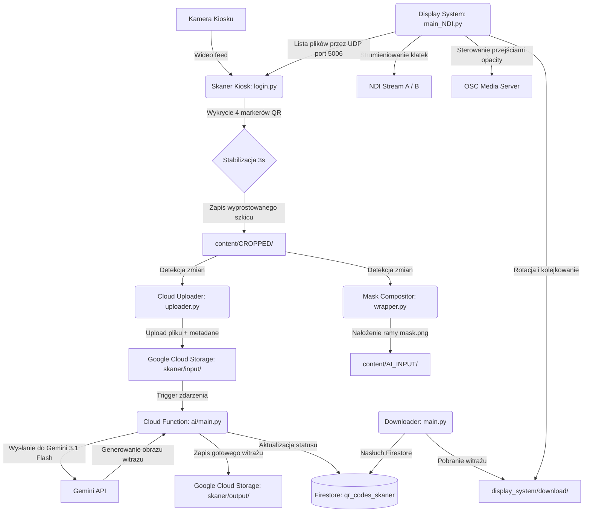

# System "Wesoła" - Distributed Stained Glass Suite

System **„Wesoła”** to rozproszony, wielowątkowy system kioskowo-projekcyjny. Umożliwia użytkownikom interaktywne tworzenie witraży na podstawie fizycznych szkiców. 

System automatycznie wykrywa kartkę papieru ze szkicem za pomocą kodów QR pełniących rolę markerów, wykonuje transformację perspektywiczną, nakłada ozdobną maskę (ramę), przesyła obraz do chmury Google Cloud, gdzie model **Gemini** (Generative AI) przekształca szkic w gotowy obraz witrażu, a następnie pobiera go i wyświetla na projektorze za pomocą standardu NDI/OSC.

---

## 🏗️ Architektura Systemu i Przepływ Danych

Poniższy diagram przedstawia ogólny przepływ danych w systemie:



---

## 📂 Struktura Projektu i Moduły

### 1. 🖥️ Skaner Kiosk (`login.py`)
Główna aplikacja kiosku uruchamiana lokalnie. Obsługuje interfejs graficzny OpenCV działający w trybie pełnoekranowym.
*   **Detekcja QR i markerów:** Wykorzystuje kody QR w formacie `POZYCJA_FIRESTORE-ID_NEW-ID` (np. `TL_uuid_style1`) umieszczone w rogach kartki (TL, TR, BL, BR) do lokalizacji dokumentu.
*   **Estymacja pozycji:** Jeżeli widoczne są tylko 3 z 4 markerów, system matematycznie oblicza pozycję brakującego rogu.
*   **Wyzwalanie:** Po wykryciu stabilnych markerów przez określony czas (`TRIGGER_TIME = 3s`), następuje automatyczne wykonanie zdjęcia, transformacja perspektywiczna (wyrównanie geometryczne do formatu 1418x1988 px) i docięcie zgodnie z `crop_config.json`.
*   **Komunikacja UDP:** Odbiera z systemu wyświetlania na porcie `5006` informacje o aktualnej kolejce pobranych grafik, by renderować pasek podglądu na dole ekranu kiosku.

### 2. 🖼️ Mask Compositor (`wrapper.py`)
Lokalny demon przetwarzania obrazu:
*   Monitoruje folder `content/CROPPED/`.
*   Wczytuje nowo wyprostowane obrazy, skaluje je i nakłada ozdobną ramę na podstawie pliku z przezroczystością `mask.png`.
*   Zapisuje wynikowy plik w `content/AI_INPUT/` oraz w archiwum sesji `full_content/`.

### 3. ☁️ Cloud Uploader (`uploader.py`)
Narzędzie do synchronizacji z chmurą:
*   Wykrywa nowe pliki w folderze `content/CROPPED/`.
*   Przesyła plik do Google Cloud Storage (`gs://skaner/input/[UUID]_[NR]_[STYLE-ID].jpg`) dodając metadane sesji (`firestore_id`, `scan_number`, `new_id`).
*   Po udanym przesłaniu archiwizuje lokalny plik.

### 4. 🧠 AI Core - Cloud Function (`ai/main.py`)
Funkcja chmurowa (GCP Gen2 Cloud Function) uruchamiana automatycznie po przesłaniu pliku do folderu `input/` w buckecie Storage.
*   Zmienia status dokumentu w kolekcji Firestore `qr_codes_skaner` na `processing`.
*   Wczytuje odpowiedni prompt na podstawie ID stylu (plik `prompt_[STYLE-ID].txt` w katalogu `ai/`, np. styl gotycki, secesyjny itp.).
*   Przesyła obraz i prompt do modelu **Gemini** (`gemini-3.1-flash-image-preview`) w celu wykonania transformacji rysunku na stylizowany witraż.
*   Zapisuje wyjściowy obraz jako `output/[UUID]/[UUID]_[SCAN_NR].png` w Storage i zmienia status w Firestore na `ready`, ustawiając pole `LastProcessedScan`.

### 5. 📥 Stained Glass Downloader (`downloader/main.py`)
Proces działający w tle po stronie klienta:
*   Nasłuchuje zmian w kolekcji Firestore `qr_codes_skaner`.
*   Gdy AI oznaczy obraz jako gotowy (`LastProcessedScan` > 0), automatycznie pobiera gotowy plik z folderu `output/` w chmurze.
*   Zapisuje pobrany plik do lokalnego folderu `display_system/download/` i przygotowuje archiwum sesji w `full_content/`.

### 6. 📽️ Display & Projection System (`display_system/`)
Odpowiada za prezentację wygenerowanych witraży na rzutniku/ekranie. Obsługuje dwie wersje działania:
*   **Wersja podstawowa (`main.py`):** Wyświetla obrazy bezpośrednio w oknie OpenCV, wykonując płynne przenikanie (Crossfade) o zadanej długości (`FADE_DURATION = 3s`) przy zmianie grafiki (co 30s).
*   **Wersja profesjonalna NDI/OSC (`main_NDI.py`):** Działa bez okna renderowania. Strumieniuje obrazy na dwóch osobnych kanałach NDI (Stream_A i Stream_B) w technologii Flip-Flop. Równolegle przesyła komendy OSC do zewnętrznego serwera mediów (np. Resolume Arena) w celu precyzyjnego sterowania przezroczystością warstw.

---

## 🛠️ Wymagania i Uruchomienie

### Wymagania systemowe
*   **System operacyjny:** Windows (skrypty i konfiguracja ścieżek dostosowane do Windows)
*   **Python:** wersja 3.11
*   **Zależności sprzętowe:** Kamera internetowa (USB / zintegrowana) obsługująca rozdzielczość 2400x1792 px (lub zbliżoną, konfigurowalna w `roi_config.json`).

### Konfiguracja i pliki kluczowe
Przed uruchomieniem upewnij się, że w katalogu głównym projektu znajdują się następujące pliki:
1.  **`serviceAccountKey.json`** – Klucz konta usługowego GCP z uprawnieniami do Firestore i Cloud Storage.
2.  **Pliki wideo UI** w katalogu głównym:
    *   `HOME.mov` – wideo stanu bezczynności (Idle)
    *   `LIMIT.mov` – wideo limitu skanów
    *   `SCAN.mov` – wideo w trakcie namierzania i skanowania kartki
    *   `LOADING.mov` – wideo oczekiwania na przetwarzanie AI
    *   `FAIL.mov` – wideo błędu/nieudanego skanowania
    *   `SUKCES.mov` – wideo potwierdzające udane wygenerowanie witrażu
3.  **`mask.png`** – Obraz z przezroczystym tłem w formacie PNG nakładany na wyjściowy szkic w module Wrapper.
4.  **`RobotoMono-SemiBold.ttf`** – Czcionka używana do renderowania napisów i HUD kolejki.

### Uruchomienie całego pakietu
Aby uruchomić wszystkie 5 lokalnych modułów równocześnie, użyj przygotowanego skryptu wsadowego:
```cmd
start_all.bat
```
Skrypt automatycznie zamknie wiszące procesy Python/Node i otworzy osobne okna terminala dla każdego z komponentów w odpowiednich środowiskach wirtualnych.
